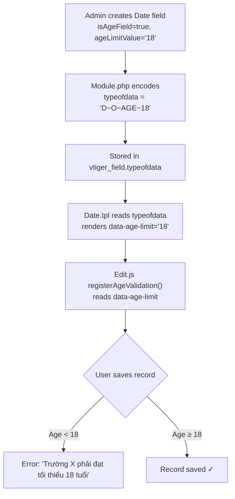

# Age Validation Feature — Walkthrough

## Overview

Implemented age constraint validation for custom **Date** fields in VtigerCRM across **6 files**, with zero database schema changes.

---

## Changes Made

### Phase 1: Custom Field Creation — Age Constraint UI & Backend

| File                                                                                                               | Change                                                                                                  |
| ------------------------------------------------------------------------------------------------------------------ | ------------------------------------------------------------------------------------------------------- |
| [Module.php](file:///c:/xampp/htdocs/cusc/modules/Settings/LayoutEditor/models/Module.php)                         | Added `ageLimitSupported` flag for Date type + encodes `D~O~AGE~18` into `typeofdata`                   |
| [FieldCreate.tpl](file:///c:/xampp/htdocs/cusc/layouts/v7/modules/Settings/LayoutEditor/FieldCreate.tpl)           | ✅ Already had checkbox + selectbox UI (lines 104–118)                                                  |
| [LayoutEditor.js](file:///c:/xampp/htdocs/cusc/layouts/v7/modules/Settings/LayoutEditor/resources/LayoutEditor.js) | Shows `.ageLimitSupported` div when Date type is selected; toggles `.ageLimitSelect` on checkbox change |
| [vi_vn/LayoutEditor.php](file:///c:/xampp/htdocs/cusc/languages/vi_vn/Settings/LayoutEditor.php)                   | Added `LBL_IS_AGE_FIELD` = "Ràng buộc tuổi", `LBL_SELECT_AGE` = "Chọn tuổi tối thiểu"                   |
| [en_us/LayoutEditor.php](file:///c:/xampp/htdocs/cusc/languages/en_us/Settings/LayoutEditor.php)                   | Added `LBL_IS_AGE_FIELD` = "Age Constraint", `LBL_SELECT_AGE` = "Select minimum age"                    |

### Phase 2: Edit View — Validation on Save

| File                                                                                | Change                                                                                                        |
| ----------------------------------------------------------------------------------- | ------------------------------------------------------------------------------------------------------------- |
| [Date.tpl](file:///c:/xampp/htdocs/cusc/layouts/v7/modules/Vtiger/uitypes/Date.tpl) | Parses `typeofdata` → adds `data-age-limit="18"` attribute to `<input>`                                       |
| [Edit.js](file:///c:/xampp/htdocs/cusc/layouts/v7/modules/Vtiger/resources/Edit.js) | Added `registerAgeValidation()` — validates age on `Pre.Record.Save` event, called from `registerBasicEvents` |

---

## Data Flow



---

## Age Calculation Logic

```javascript
// Tính tuổi chính xác (kể cả sinh nhật chưa qua trong năm nay)
var age = today.getFullYear() - dob.getFullYear();
var monthDiff = today.getMonth() - dob.getMonth();
if (monthDiff < 0 || (monthDiff === 0 && today.getDate() < dob.getDate())) {
  age--;
}
```

**Test cases (today = 25/02/2026):**

| Date of Birth | Age                    | Limit 18 | Result   |
| ------------- | ---------------------- | -------- | -------- |
| 26/08/2003    | 22                     | ≥ 18     | ✅ Pass  |
| 01/01/2025    | 1                      | < 18     | ❌ Error |
| 25/02/2008    | 18 (exact today)       | = 18     | ✅ Pass  |
| 26/02/2008    | 17 (birthday tomorrow) | < 18     | ❌ Error |

---

## Manual Testing Steps

### Phase 1 Test — Create Custom Field

1. Go to **Settings → Module Manager → Contacts → Layout Editor**
2. Click **Add Custom Field** on any block
3. Select **Date** from "Select Field Type" dropdown
4. Verify **"Ràng buộc tuổi"** checkbox appears
5. Check the checkbox → verify the age select dropdown shows (options 10–25)
6. Choose **18**, fill in a label, click **Save**

### Phase 2 Test — Validate on Save

1. Go to **Contacts → + Add Contact**
2. Fill the date field with `01-01-2025` → **Save** → expect error about minimum age
3. Change to `26-08-2003` → **Save** → should succeed ✓
