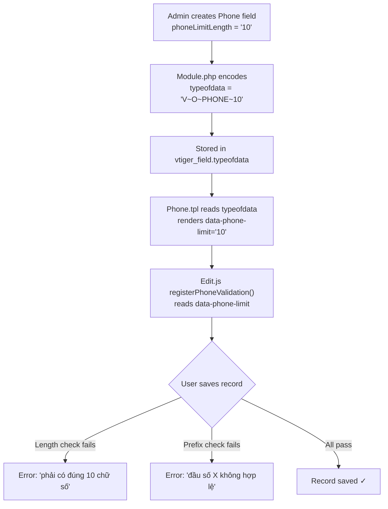

# Phone Validation Feature — Walkthrough

## Overview

Implemented phone number length limit + Vietnamese mobile prefix validation in VtigerCRM across 8 files, with zero database schema changes.

---

## Changes Made

### Phase 1: Custom Field Creation — Phone Length Limit

| File                                                                                                               | Change                                                                                    |
| ------------------------------------------------------------------------------------------------------------------ | ----------------------------------------------------------------------------------------- |
| [Module.php](file:///c:/xampp/htdocs/cusc/modules/Settings/LayoutEditor/models/Module.php)                         | Added `phoneLimitSupported` flag + encoded limit into `typeofdata` as `V~O~PHONE~{limit}` |
| [FieldCreate.tpl](file:///c:/xampp/htdocs/cusc/layouts/v7/modules/Settings/LayoutEditor/FieldCreate.tpl)           | Added `phoneLimitSupported` input section (lines 87-103)                                  |
| [LayoutEditor.js](file:///c:/xampp/htdocs/cusc/layouts/v7/modules/Settings/LayoutEditor/resources/LayoutEditor.js) | Show `.phoneLimitSupported` div when Phone type is selected                               |
| [LayoutEditor.php (vi)](file:///c:/xampp/htdocs/cusc/languages/vi_vn/Settings/LayoutEditor.php)                    | Added `LBL_PHONE_LIMIT_LENGTH` = "Giới hạn độ dài SĐT"                                    |
| [LayoutEditor.php (en)](file:///c:/xampp/htdocs/cusc/languages/en_us/Settings/LayoutEditor.php)                    | Added `LBL_PHONE_LIMIT_LENGTH` = "Phone Limit Length"                                     |

### Phase 2: Edit View — Validation on Save

| File                                                                                  | Change                                                                                             |
| ------------------------------------------------------------------------------------- | -------------------------------------------------------------------------------------------------- |
| [Phone.tpl](file:///c:/xampp/htdocs/cusc/layouts/v7/modules/Vtiger/uitypes/Phone.tpl) | Parses `typeofdata` → adds `data-phone-limit` attribute to `<input>`                               |
| [Phone.php](file:///c:/xampp/htdocs/cusc/modules/Vtiger/uitypes/Phone.php)            | Added `getPhoneLimit()` method (parses `typeofdata`)                                               |
| [Edit.js](file:///c:/xampp/htdocs/cusc/layouts/v7/modules/Vtiger/resources/Edit.js)   | Added `registerPhoneValidation()` — validates length + 32 Vietnamese prefixes on `Pre.Record.Save` |

---

## Data Flow

---

## Vietnamese Prefix List (32 prefixes)

| Carrier          | Prefixes                    |
| ---------------- | --------------------------- |
| **Viettel**      | 032-039, 086, 096-098       |
| **Vinaphone**    | 081-085, 088, 091, 094      |
| **MobiFone**     | 070, 076-079, 089, 090, 093 |
| **Vietnamobile** | 056, 058, 092               |
| **Gmobile**      | 059, 099                    |
| **Itelecom**     | 087                         |

---

## Manual Testing Steps

### Phase 1 Test

1. Go to **Settings → Module Manager → Contacts → Layout Editor**
2. Click **Add Custom Field** on any block
3. Select **Phone** → verify "Giới hạn độ dài SĐT" input appears
4. Enter `10`, fill label, click Save → field should be created

### Phase 2 Test

1. Go to **Contacts → + Add Contact**
2. Enter `1234567` (7 digits) in the phone field → Save → expect error about length
3. Enter `0111234567` (invalid prefix `011`) → Save → expect error about prefix
4. Enter `0321234567` (valid Viettel prefix `032`) → Save → should succeed ✓
